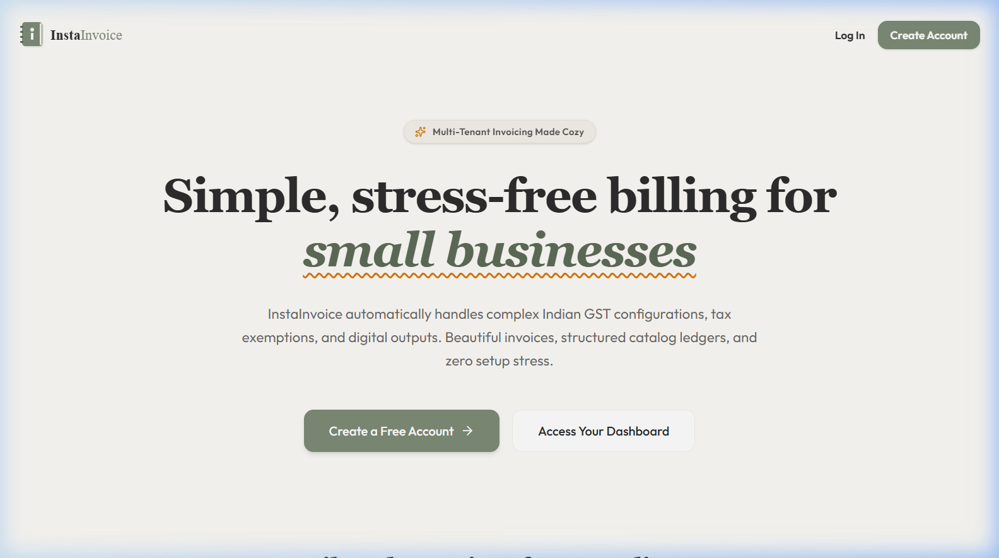
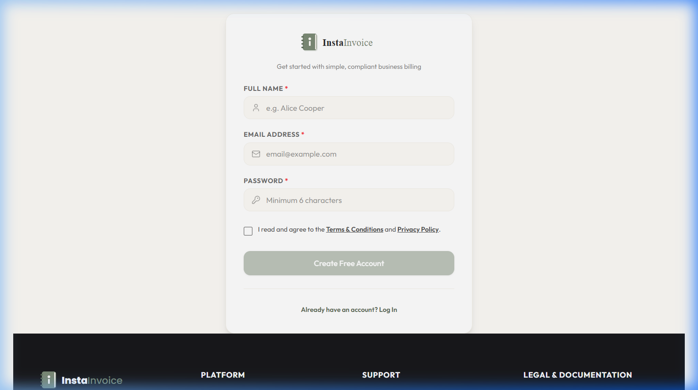
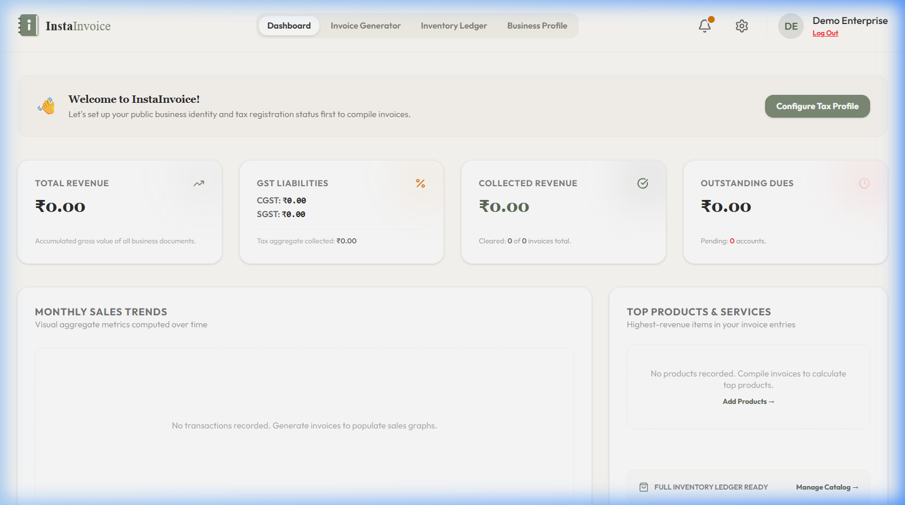
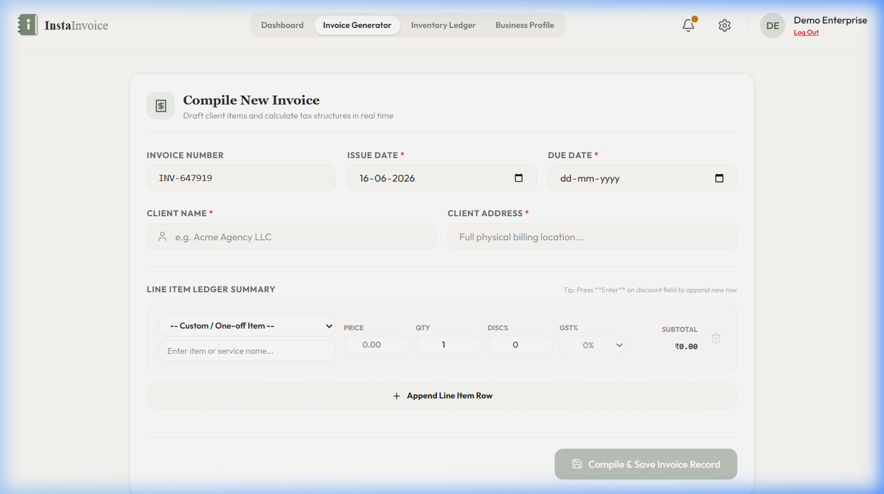
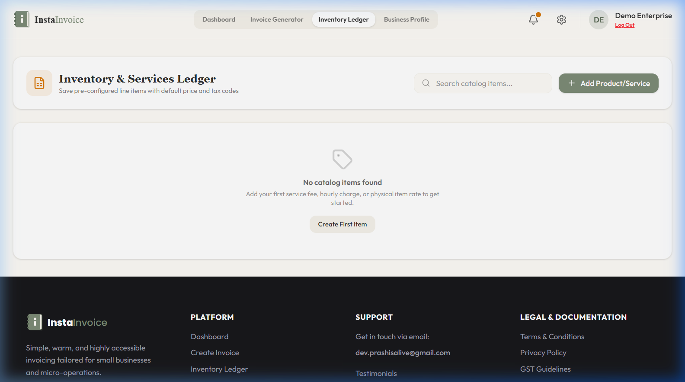
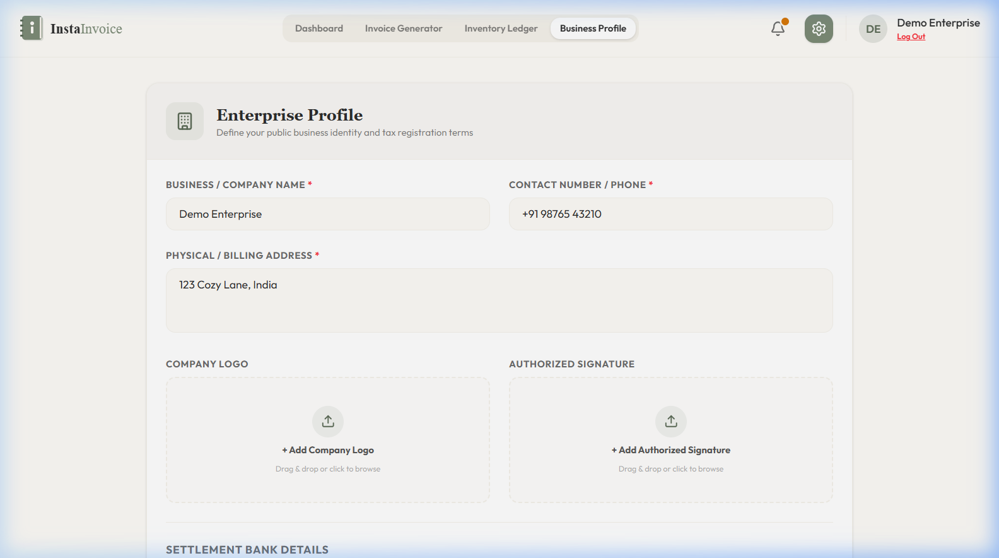
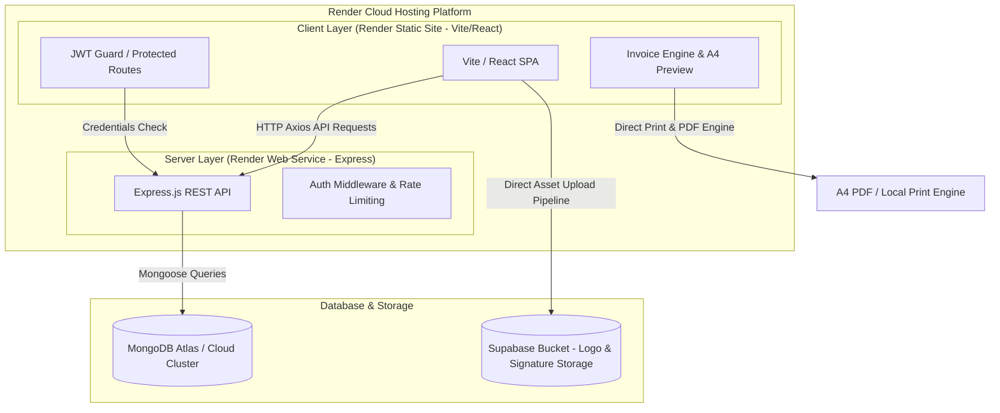

# 🧾 InstaInvoice

> A modern, elegant, and full-stack invoice management platform built with a cozy, professional aesthetic. Fully responsive, secure, and optimized for seamless A4 PDF export.

✨ **Live Link**: [instainvoice.onrender.com](https://instainvoice.onrender.com)

[](https://instainvoice.onrender.com)
[](LICENSE)
[](https://github.com/Prash-code9428/InstaInvoice/stargazers)
[](https://render.com)
[](https://react.dev)

---

## 🎨 The Cozy Design System
InstaInvoice is styled around a curated, harmonious **Cozy Warm & Sage** color palette. It avoids generic styling in favor of organic tones, smooth transitions, and premium typography (`Outfit` & `Poppins` from Google Fonts).

| Token Name | Hex Value | Preview | Role |
| :--- | :--- | :--- | :--- |
| `cozy-cream` | `#FDFBF7` | 🟩 `■` | Primary Background |
| `cozy-sand` | `#F4F1EA` | 🟩 `■` | Secondary Cards & Accents |
| `cozy-charcoal`| `#2D2D2D` | 🟩 `■` | Primary Typography & Headers |
| `cozy-sage` | `#7D8C77` | 🟩 `■` | Accent Green / Primary CTAs |
| `cozy-sage-dark`| `#5D6C58` | 🟩 `■` | CTA Hovers & Active States |
| `cozy-amber` | `#D97706` | 🟩 `■` | Warning states, Pending badges |

---

## 🚀 Key Features

*   🔒 **Secure Authentication & Recovery**: JWT-based secure user sessions, bcrypt-hashed passwords, and multi-step security question recovery validation during registration, login, and settings update.
*   📊 **Analytics Dashboard**: Dynamic sales reporting, total revenue counters, invoice statuses, and product metrics.
*   ✍️ **Invoice Engine**: Add, edit, and remove dynamic items. Custom TAX/Discount modifiers, instant subtotal adjustments.
*   📁 **Cloud Media Uploads**: Integrated Supabase storage pipelines for seamless custom logo and signature branding.
*   🖨️ **Optimized Print & PDF Engine**: Custom CSS media-print layouts matching standard A4 dimensions with dual export support (Direct Print + High-Resolution PDF Download).
*   ⭐ **Sliding Testimonials Carousel**: Premium testimonials slider with custom transitions, chevrons, and dots pagination.

---

## 📸 Application Showcase

Here is a visual walk-through of the InstaInvoice platform layout, displaying screenshots at full size for maximum clarity:

### 💻 Landing Page


---

### 🔒 Secure Register & Recovery Configuration


---

### 📊 Analytics Dashboard


---

### ✍️ Invoice Engine & A4 Document Builder


---

### 📁 Inventory Ledger


---

### ⚙️ Business Profile & Account Security Settings


---

## 🏗️ Architecture & Data Flow



---

## 📂 Project Directory Structure

```text
InstaInvoice/
├── backend/
│   ├── config/             # Database connection setup
│   ├── middleware/         # Auth verification guards
│   ├── models/             # Mongoose schemas (User, Invoice, Profile, etc.)
│   ├── routes/             # REST Endpoints (auth, profile, invoices, etc.)
│   ├── server.js           # Express App Entry Point
│   └── package.json
├── frontend/
│   ├── src/
│   │   ├── components/     # UI Views & Dashboards (Landing Page, InvoiceEngine, etc.)
│   │   ├── utils/          # Client utilities (Supabase Client, helper classes)
│   │   ├── App.jsx         # App router layout
│   │   ├── main.jsx        # App mounting and Axios default config
│   │   └── index.css       # Tailwind 4 Cozy theme tokens & CSS overrides
│   └── package.json
└── README.md
```

---

## ⚙️ Local Development Setup

### 1️⃣ Clone the Repository
```bash
git clone https://github.com/Prash-code9428/InstaInvoice.git
cd InstaInvoice
```

### 2️⃣ Configure Backend Environment
Create a `.env` file in the `backend/` directory:
```env
PORT=5000
MONGO_URI=your_mongodb_atlas_connection_string
JWT_SECRET=your_jwt_signing_secret_key
JWT_EXPIRES_IN=7d
```

### 3️⃣ Configure Frontend Environment
Create a `.env` file in the `frontend/` directory:
```env
VITE_API_URL=http://localhost:5000
VITE_SUPABASE_URL=your_supabase_project_url
VITE_SUPABASE_ANON_KEY=your_supabase_anon_key
```
*(Note: Supabase configuration is optional, but required if you want logo and signature image uploads to functional. You can spin up a free project on Supabase and fetch these under Project Settings -> API)*

### 4️⃣ Run the Services
*   **Start the API Server**:
    ```bash
    cd backend
    npm install
    npm run dev
    ```
*   **Start the React SPA**:
    ```bash
    cd ../frontend
    npm install
    npm run dev
    ```

---

## ☁️ Deploying to Render

You can easily deploy InstaInvoice on [Render](https://render.com) using two separate services from this single monorepo.

### 🌐 Step A: Push Code to GitHub
Ensure all your latest changes are pushed to your GitHub repository:
```bash
git add .
git commit -m "feat: optimize invoice print & pdf export, update render hosting"
git push origin main
```

### 🛢️ Step B: Deploy the Backend (Web Service)
1. Go to [Render Dashboard](https://dashboard.render.com/) and click **New +** $\rightarrow$ **Web Service**.
2. Connect your `InstaInvoice` GitHub repository.
3. Configure the settings:
   - **Name**: `instainvoice-backend`
   - **Root Directory**: `backend`
   - **Runtime**: `Node`
   - **Build Command**: `npm install`
   - **Start Command**: `npm start`
   - **Instance Type**: `Free`
4. Add the following **Environment Variables**:
   * `NODE_ENV` = `production`
   * `MONGO_URI` = *(Your MongoDB Atlas connection URI)*
   * `JWT_SECRET` = *(A secure random secret key)*
   * `JWT_EXPIRES_IN` = `7d`
5. Click **Create Web Service**.
6. Once deployed, copy your backend URL (e.g. `https://instainvoice-backend.onrender.com`).

### 🖥️ Step C: Deploy the Frontend (Static Site)
1. In Render Dashboard, click **New +** $\rightarrow$ **Static Site**.
2. Connect the same `InstaInvoice` repository.
3. Configure the settings:
   - **Name**: `instainvoice`
   - **Root Directory**: `frontend`
   - **Build Command**: `npm install && npm run build`
   - **Publish Directory**: `dist`
4. Add **Environment Variables**:
   * `VITE_API_URL` = *(Your Render Backend URL from Step B, e.g. `https://instainvoice-backend.onrender.com`)*
   * `VITE_SUPABASE_URL` = *(Your Supabase project URL)*
   * `VITE_SUPABASE_ANON_KEY` = *(Your Supabase public anon key)*
5. **Set up SPA Client-Side Routing**:
   - In your Static Site settings $\rightarrow$ **Redirects / Rewrites** tab, add a rule:
     - **Source**: `/*`
     - **Destination**: `/index.html`
     - **Action**: `Rewrite`
6. Click **Create Static Site**.

---

## 📝 License
Distributed under the MIT License. See `LICENSE` for more information.
