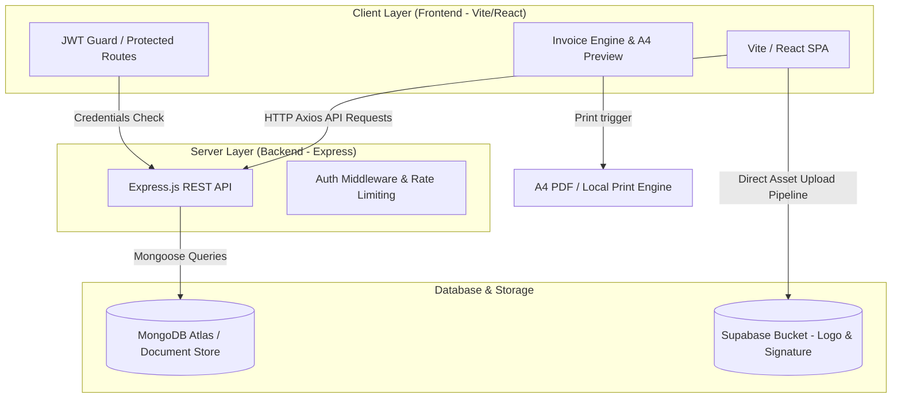

# 🧾 InstaInvoice

> A modern, elegant, and full-stack invoice management platform built with a cozy, professional aesthetic. Fully responsive, secure, and optimized for seamless A4 PDF export.

[](LICENSE)
[](https://github.com/Prash-code9428/InstaInvoice/stargazers)
[](https://railway.app)
[](https://react.dev)

---

## 🎨 The Cozy Design System
InstaInvoice is styled around a curated, harmonious **Cozy Warm & Sage** color palette. It avoids generic styling in favor of organic tones, smooth transitions, and premium typography (`Outfit` & `Poppins` from Google Fonts).

| Token Name | Hex Value | Preview | Role |
| :--- | :--- | :--- | :--- |
| `cozy-cream` | `#FDFBF7` | 🟩 `■` | Primary Background |
| `cozy-sand` | `#F4F1EA` | 🟩 `■` | Secondary Cards & Accents |
| `cozy-charcoal`| `#2D2D2D` | 🟩 `■` | Primary Typography & Headers |
| `cozy-sage` | `#7D8C77` | 🟩 `■` | Accent Green / Primary CTAs |
| `cozy-sage-dark`| `#5D6C58` | 🟩 `■` | CTA Hovers & Active States |
| `cozy-amber` | `#D97706` | 🟩 `■` | Warning states, Pending badges |

---

## 🚀 Key Features

*   🔒 **Secure Authentication**: JWT-based secure user sessions with bcrypt-hashed password pipelines.
*   📊 **Analytics Dashboard**: Dynamic sales reporting, total revenue counters, invoice statuses, and product metrics.
*   ✍️ **Invoice Engine**: Add, edit, and remove dynamic items. Custom TAX/Discount modifiers, instant subtotal adjustments.
*   📁 **Cloud Media Uploads**: Integrated Supabase storage pipelines for seamless custom logo and signature branding.
*   🖨️ **Optimized Print Engine**: Custom CSS media-print layouts matching standard A4 dimensions perfectly.
*   ⭐ **Customer Reviews Widget**: Live testimonial and reviews feed inside the app.

---

## 🏗️ Architecture & Data Flow



---

## 📂 Project Directory Structure

```text
InstaInvoice/
├── backend/
│   ├── config/             # Database connection setup
│   ├── middleware/         # Auth verification guards
│   ├── models/             # Mongoose schemas (User, Invoice, Profile, etc.)
│   ├── routes/             # REST Endpoints (auth, profile, invoices, etc.)
│   ├── server.js           # Express App Entry Point
│   └── package.json
├── frontend/
│   ├── src/
│   │   ├── components/     # UI Views & Dashboards (Landing Page, InvoiceEngine, etc.)
│   │   ├── utils/          # Client utilities (Supabase Client, helper classes)
│   │   ├── App.jsx         # App router layout
│   │   ├── main.jsx        # App mounting and Axios default config
│   │   └── index.css       # Tailwind 4 Cozy theme tokens & CSS overrides
│   └── package.json
└── README.md
```

---

## ⚙️ Local Development Setup

### 1️⃣ Clone the Repository
```bash
git clone https://github.com/Prash-code9428/InstaInvoice.git
cd InstaInvoice
```

### 2️⃣ Configure Backend Environment
Create a `.env` file in the `backend/` directory:
```env
PORT=5000
MONGO_URI=your_mongodb_atlas_connection_string
JWT_SECRET=your_jwt_signing_secret_key
JWT_EXPIRES_IN=7d
```

### 3️⃣ Configure Frontend Environment
Create a `.env` file in the `frontend/` directory (for local fallback, Vite uses `http://localhost:5000` by default):
```env
VITE_API_URL=http://localhost:5000
```

### 4️⃣ Run the Services
*   **Start the API Server**:
    ```bash
    cd backend
    npm install
    npm run dev
    ```
*   **Start the React SPA**:
    ```bash
    cd ../frontend
    npm install
    npm run dev
    ```

---

## ☁️ Deploying to Railway

Railway is the fastest way to get your monorepo online. You will deploy **two separate services** from the same GitHub repository.

### 🌐 Step A: Update your GitHub Repository
Since we updated the frontend package dependencies, commit and push these updates:
```bash
git add .
git commit -m "chore: optimize frontend build configuration for Railway hosting"
git push origin main
```

### 🛢️ Step B: Deploy the Backend Service
1.  Go to [Railway.app](https://railway.app) and create a **New Project**.
2.  Select **Deploy from GitHub repo** and select your `InstaInvoice` repository.
3.  Once the service is created, go to **Settings** -> **General** -> **Service Name** and rename it to `instainvoice-backend`.
4.  Scroll to **Settings** -> **Build & Deploy** -> **Root Directory** and set it to `/backend`.
5.  Go to the **Variables** tab and add:
    *   `PORT` = `5000`
    *   `MONGO_URI` = *(Your MongoDB Atlas connection URI)*
    *   `JWT_SECRET` = *(Any secure random secret string)*
6.  Go to the **Networking** tab, click **Generate Domain** to get your backend URL. Copy this domain (e.g. `https://instainvoice-backend-production.up.railway.app`).

### 🖥️ Step C: Deploy the Frontend Service
1.  In the same Railway project dashboard, click **New** -> **GitHub Repo** and select the same `InstaInvoice` repository again.
2.  Go to **Settings** -> **General** -> **Service Name** and rename it to `instainvoice-frontend`.
3.  Scroll to **Settings** -> **Build & Deploy** -> **Root Directory** and set it to `/frontend`.
4.  Go to the **Variables** tab and add:
    *   `VITE_API_URL` = *(Paste the dynamic backend URL generated in Step B, e.g. `https://instainvoice-backend-production.up.railway.app`)*
5.  Go to the **Networking** tab and click **Generate Domain** to get your frontend live link.
6.  **Done!** Your live application is fully active.

---

## 📝 License
Distributed under the MIT License. See `LICENSE` for more information.
